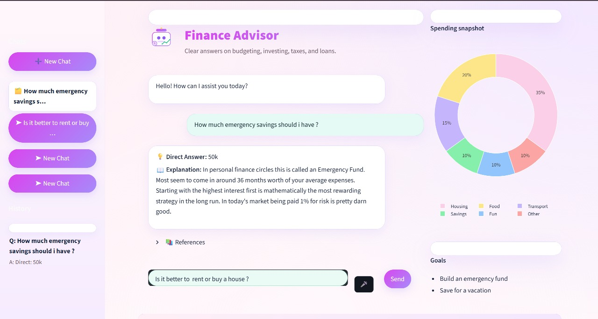

# Financial Question Answering Chatbot

A comprehensive NLP pipeline for processing and analyzing financial question-answer pairs from the FIQA dataset. This project includes text cleaning, normalization, visualization, and prepares data for financial question answering tasks.


Example visualization of the financial QA Chatbot

## 🚀 Features

- **Financial Text Cleaning**: Specialized cleaning for financial terminology and currency normalization
- **Currency Normalization**: Standardizes currency mentions ($50K → 50000 USD, €2.5M → 2500000 EUR)
- **Interactive Visualizations**: Plotly-based word frequency analysis and tag clouds
- **NLP Preprocessing**: Tokenization, stopword removal, and text normalization
- **Dataset Integration**: Direct loading from Hugging Face datasets

## 📊 Dataset

The project uses the `bilalRahib/fiqa-personal-finance-dataset` from Hugging Face, containing:
- 1,987 financial question-answer pairs
- Diverse financial topics: taxes, investments, stocks, loans, and more
- Cleaned and normalized text data

## 🛠️ Installation

1. Clone the repository:
```bash
git clone https://github.com/H-Yahya2214/financial-qa-system.git
cd financial-qa
```
2. Install dependencies:
```bash
pip install -r requirements.txt
```
3. Download NLTK resources:
```bash
import nltk
nltk.download('punkt')
nltk.download('stopwords')
nltk.download('wordnet')
nltk.download('averaged_perceptron_tagger')
```
## 💻 Usage
- **Data Loading & Cleaning**:
```bash
from datasets import load_dataset

# Load the FIQA dataset
ds = load_dataset("bilalRahib/fiqa-personal-finance-dataset")
df = pd.concat([ds[split].to_pandas() for split in ds.keys()])

# Clean and normalize financial text
df = normalize_dataframe_text(df, ['question', 'answer'])
```
-**Currency Normalization Examples**:
The system automatically normalizes:

$50K → 50000 USD

€2.5M → 2500000 EUR

40-50K → 40000-50000 USD

30k ish → 30000 USD approx.

-**Visualization**:
Generate interactive word frequency charts and tag clouds:
```bash
# Top words visualization
fig = px.bar(df_words, x="count", y="word", orientation="h", 
             title="Top 20 Most Frequent Words")
fig.show()
```
## 📈 Project Structure
```bash
financial-qa/
├── images/
│   └── demo.jpeg
├── notebooks/
│   └── GRAD_Project_last.ipynb    # Main analysis notebook
├── src/
│   ├── data_cleaning.py           # Text normalization functions
│   ├── visualization.py           # Plotting utilities
│   └── preprocessing.py           # NLP preprocessing
├── requirements.txt
├── README.md
└── .gitignore
```

